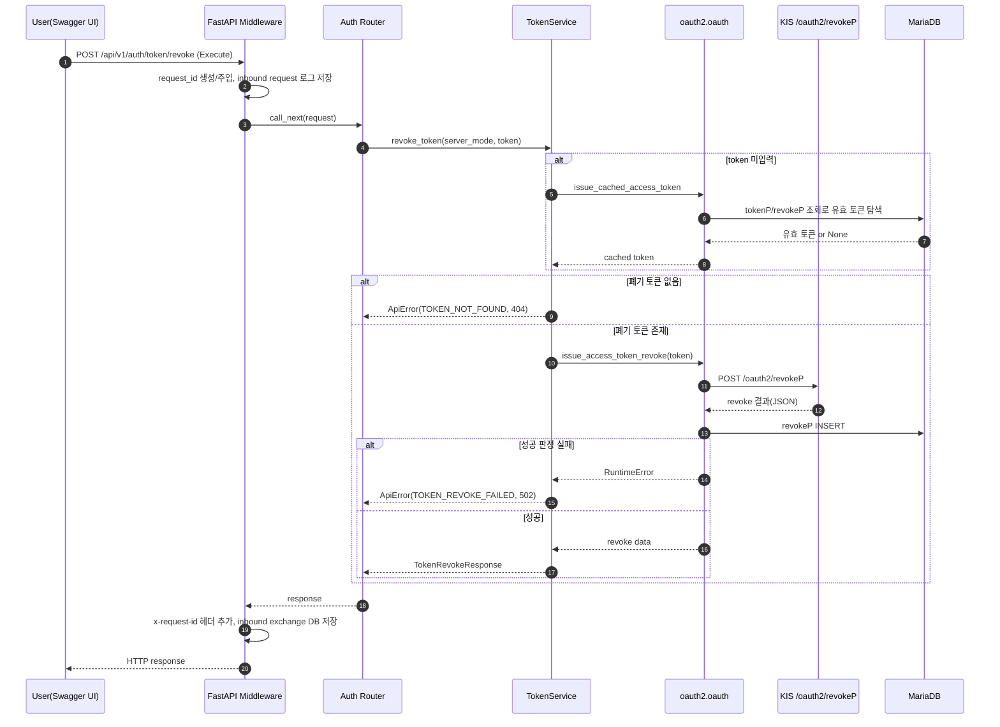

# revoke_token_api_v1_auth_token_revoke_post 실행 단계 상세 분석

## 1. 분석 대상
- Swagger UI 경로: `http://localhost:8001/docs#/auth/revoke_token_api_v1_auth_token_revoke_post`
- API 엔드포인트: `POST /api/v1/auth/token/revoke`
- FastAPI operation: `revoke_token_api_v1_auth_token_revoke_post`

본 문서는 Swagger UI에서 Execute 버튼을 누른 순간부터, 백엔드 내부 처리(요청 검증, 서비스 로직, 외부 KIS 호출, DB 저장, 응답 반환, 로깅)까지의 전체 실행 단계를 코드 기준으로 추적한 결과이다.


## 1.1 Execute 이후 전체 호출 체인 (파일명 + 함수명)
1. `src/app/main.py` -> `create_app()`
2. `src/app/core/logging.py` -> `request_logging_middleware()`
3. `src/app/api/routes/auth.py` -> `revoke_token()`
4. `src/app/services/token_service.py` -> `TokenService.revoke_token()`
5. `src/kis_auth.py` -> `issue_access_token_revoke()`
6. `src/oauth2/oauth.py` -> `revoke_access_token()`
7. `src/logger.py` -> `log_http_request()`, `log_http_response()`
8. `src/oauth2/oauth.py` -> `_save_revoke()`
9. `src/db.py` -> `get_connection()`
10. `src/app/core/exceptions.py` -> `register_exception_handlers()`에 등록된 핸들러 중 하나로 응답 표준화
11. `src/app/core/logging.py` -> `request_logging_middleware()` 후처리(`save_http_exchange()` 호출 포함)


## 2. 사전 라우팅 구성
- FastAPI 앱은 `app.main.create_app()`에서 `api_prefix`를 `/api/v1`로 설정한다.
- `app.api.router`에서 `auth_router`를 포함한다.
- `auth_router`의 prefix는 `/auth`이고, revoke 라우트는 `/token/revoke`이다.
- 최종 URL은 `POST /api/v1/auth/token/revoke`로 합성된다.

호출 파일/함수:
- `src/app/main.py` -> `create_app()`
- `src/app/api/router.py` -> `api_router.include_router(auth_router)`
- `src/app/api/routes/auth.py` -> `router = APIRouter(prefix="/auth", ...)`, `@router.post("/token/revoke", ...)`


## 3. Execute 클릭 직후 클라이언트 측 동작
1. Swagger UI가 요청 바디 입력값을 JSON으로 직렬화한다.
2. 사용자가 body를 비워서 실행하면 요청 바디가 비어 있거나 `{}` 형태로 전송될 수 있다.
3. 브라우저가 `POST /api/v1/auth/token/revoke` 요청을 전송한다.
4. 기본적으로 `Content-Type: application/json` 요청이 들어온다.


## 4. 서버 진입 직후 (미들웨어 단계)
`request_logging_middleware`가 라우팅 전에 먼저 수행된다.

1. `x-request-id` 헤더가 있으면 사용, 없으면 UUID 생성.
2. 요청 바디를 바이트로 1회 읽고 문자열로 변환.
3. 이후 라우터에서도 읽을 수 있도록 내부 `receive()`를 재구성해 body 재주입.
4. 파일 로그에 inbound 요청 원문 기록:
   - `log_http_request(api_id="fastapi_inbound", ...)`
5. `call_next(request)`로 실제 라우터 처리 진입.

호출 파일/함수:
- `src/app/core/logging.py` -> `request_logging_middleware()`
- `src/logger.py` -> `log_http_request()`


## 5. 라우터 바인딩 및 요청 모델 처리
핸들러: `app.api.routes.auth.revoke_token`

시그니처:
- `request: TokenRevokeRequest | None = Body(default=None)`
- `service: TokenService = Depends(get_token_service)`

실행 순서:
1. FastAPI가 의존성 주입으로 `get_token_service()` 호출.
2. `TokenService` 인스턴스 생성.
3. 바디가 있으면 `TokenRevokeRequest`로 검증/파싱.
4. 바디가 없으면 `request is None`이고, 코드에서 `TokenRevokeRequest()` 기본값 생성.
   - 기본값: `server_mode="real"`, `token=None`
5. 최종적으로 `service.revoke_token(server_mode=request_data.server_mode, token=request_data.token)` 호출.

호출 파일/함수:
- `src/app/api/routes/auth.py` -> `revoke_token()`
- `src/app/services/token_service.py` -> `get_token_service()`
- `src/app/schemas/auth.py` -> `TokenRevokeRequest`


## 6. 서비스 계층 핵심 로직
함수: `TokenService.revoke_token(server_mode: str = "real", token: str | None = None)`

### 6.1 폐기 대상 토큰 결정
`revoked_token = token or ((issue_cached_access_token(env_dv=server_mode) or {}).get("access_token"))`

- 사용자가 body.token을 넣으면 그 값을 우선 사용.
- 미입력 시 DB 캐시 토큰 조회 경로로 진입.

### 6.2 캐시 토큰 조회 경로 (token 미입력 시)
`issue_cached_access_token -> get_cached_access_token -> _get_valid_token`

`_get_valid_token`의 내부 동작:
1. DB 접속 (`db.get_connection`, MariaDB 127.0.0.1:3307).
2. `tokenP`에서 최근 토큰 후보 조회.
   - `LEFT JOIN revokeP` + `r.code='0'` 조건으로 이미 성공 폐기된 토큰은 1차 제외.
3. 후보 토큰별로 추가 검증:
   - `_has_blocking_revoke_history`: 최근 폐기 이력(code/message)로 재사용 차단 여부 확인.
   - `_is_token_expired`: 만료 시각 파싱 후 만료 여부 확인.
4. 만료 토큰이면 `_save_revoke`를 통해 `revokeP`에 자동 폐기 이력 저장.
5. 유효 토큰 발견 시 반환.
6. 유효 토큰이 없으면 `None` 반환.

호출 파일/함수:
- `src/app/services/token_service.py` -> `TokenService.revoke_token()`
- `src/kis_auth.py` -> `issue_cached_access_token()`
- `src/oauth2/oauth.py` -> `get_cached_access_token()`, `_get_valid_token()`, `_has_blocking_revoke_history()`, `_is_token_expired()`, `_save_revoke()`
- `src/db.py` -> `get_connection()`

### 6.3 토큰 미발견 분기
- `revoked_token`이 끝까지 비어 있으면 `ApiError` 발생:
  - `code="TOKEN_NOT_FOUND"`
  - `status_code=404`
  - 메시지: `폐기할 토큰이 없습니다.`

### 6.4 실제 폐기 호출
`issue_access_token_revoke(revoked_token, env_dv=server_mode)` 호출.

예외 처리:
- 내부에서 어떤 예외든 발생하면 서비스 계층에서 캐치 후 `ApiError`로 변환:
  - `code="TOKEN_REVOKE_FAILED"`
  - `status_code=502`
  - `detail={"reason": "원본예외문자열"}`

정상 시:
- `TokenRevokeResponse` 생성 후 반환
  - `server_mode`, `host`, `revoked_token`, `code`, `message`, `raw`

호출 파일/함수:
- `src/app/services/token_service.py` -> `TokenService.revoke_token()`
- `src/kis_auth.py` -> `issue_access_token_revoke()`
- `src/app/schemas/auth.py` -> `TokenRevokeResponse`


## 7. OAuth2 모듈 실제 외부 호출 단계
함수: `oauth2.oauth.revoke_access_token`

1. 설정 로드 (`load_config`)로 appkey/appsecret/base URL 획득.
2. 서버 모드 결정:
   - demo -> `my_url_vts`
   - real -> `my_url`
3. URL 생성: `base_url + /oauth2/revokeP` (`api_id=ka10002` 스펙)
4. 요청 payload 구성:
   - `appkey`, `appsecret`, `token`
5. `requests.Session` + `Request("POST", ...)` 준비.
6. outbound 요청 로깅:
   - `log_http_request(api_id="ka10002", ...)`
7. 외부 전송: `session.send(preq, timeout=15)`
8. 응답 로깅:
   - `log_http_response(req_id=..., response_status=..., ... )`
9. HTTP 상태 검사:
   - `response.raise_for_status()`
   - 4xx/5xx면 `requests.HTTPError` 발생
10. 응답 본문 출력(`_print_response`) 후 JSON 파싱.
11. `revokeP` 테이블에 결과 저장 (`_save_revoke`).
12. 비즈니스 성공 판정 (`_is_revoke_success`):
   - `code == "0"` 이면 성공
   - 또는 message에 `성공` 포함 + `실패` 미포함이면 성공
13. 성공 판정 실패 시 `RuntimeError` 발생.
14. 성공 시 JSON(dict) 반환.

호출 파일/함수:
- `src/oauth2/oauth.py` -> `revoke_access_token()`, `_base_url()`, `_build_request_body()`, `_print_response()`, `_save_revoke()`, `_is_revoke_success()`
- `src/logger.py` -> `log_http_request()`, `log_http_response()`
- `src/db.py` -> `get_connection()`


## 8. DB 저장 포인트 정리
## 8.1 반드시 기록되는 것
- `revoke_access_token` 호출 후 외부 응답 JSON은 `revokeP` 테이블에 INSERT 시도.

컬럼 매핑:
- `req_appkey` <- 설정의 appkey
- `req_appsecret` <- 설정의 appsecret
- `req_token` <- 폐기 대상 토큰
- `code`, `message` <- KIS revoke 응답

## 8.2 조건부 기록
- 토큰 자동 만료 처리 경로에서 `_save_revoke(..., code="0", message="AUTO_REVOKED_EXPIRED_TOKEN(...)")` 기록 가능.


## 9. 응답 반환 및 후처리 (미들웨어 복귀)
라우터 함수가 결과(정상 또는 예외 처리 응답)를 만들고 나면, 미들웨어가 후처리를 수행한다.

1. 응답 body 전체를 다시 읽음.
2. 응답 헤더에 `x-request-id` 주입.
3. 요청 단계에서 생성한 req_id가 있으면 파일 로그에 outbound 응답 원문 기록.
4. `http_exchange_log` 테이블에 inbound 트랜잭션 저장:
   - source=`fastapi`, api_id=`fastapi_inbound`, direction=`inbound`
   - req/rsp headers, body, status 저장
5. 최종 응답 반환.

호출 파일/함수:
- `src/app/core/logging.py` -> `request_logging_middleware()`, `_read_response_body()`
- `src/logger.py` -> `log_http_response()`
- `src/audit_db.py` -> `save_http_exchange()`, `_ensure_http_table()`


## 10. 실패/예외 분기별 최종 HTTP 응답
### 10.1 요청 검증 실패 (422)
- 예: `server_mode`가 `real|demo` 외 값
- `RequestValidationError` 핸들러가 표준 에러 바디 반환.

### 10.2 토큰 없음 (404)
- `TOKEN_NOT_FOUND`
- body.token 미입력 + DB 유효 토큰 미발견 시.

### 10.3 외부 폐기 실패 또는 내부 런타임 실패 (502)
- `TOKEN_REVOKE_FAILED`
- 원인 예:
  - 외부 `/oauth2/revokeP` HTTP 4xx/5xx
  - 응답 code/message가 성공 판정 실패
  - 네트워크/타임아웃/JSON 파싱 등 예외

### 10.4 미처리 예외 (500)
- 전역 Exception 핸들러가 `INTERNAL_SERVER_ERROR` 반환.

호출 파일/함수:
- `src/app/core/exceptions.py` -> `register_exception_handlers()`
- `src/app/core/exceptions.py` -> `handle_api_error()`
- `src/app/core/exceptions.py` -> `handle_validation_error()`
- `src/app/core/exceptions.py` -> `handle_http_error()`
- `src/app/core/exceptions.py` -> `handle_unexpected_error()`

에러 공통 바디 형태:
```json
{
  "error": {
    "code": "...",
    "message": "...",
    "detail": {}
  },
  "path": "/api/v1/auth/token/revoke",
  "request_id": "..."
}
```


## 11. 시퀀스 다이어그램



## 12. 운영 관점 체크 포인트
- Swagger Execute는 단순히 FastAPI 엔드포인트를 호출하며, 실제 핵심 폐기 작업은 `oauth2.oauth.revoke_access_token`에서 수행된다.
- 성공/실패와 무관하게 폐기 응답은 `revokeP` 저장을 먼저 시도한 뒤, 비즈니스 성공 판정을 수행한다.
- 결과 추적은 아래 3곳을 같이 보는 것이 가장 빠르다.
  - `log/YYYYMMDD_koreainvestment.log` (요청/응답 raw)
  - `revokeP` (폐기 결과 이력)
  - `http_exchange_log` (FastAPI inbound 감사 로그)


## 13. 결론
Swagger UI의 Execute 클릭은 `POST /api/v1/auth/token/revoke` 트랜잭션을 시작하며, 이 트랜잭션은
1) FastAPI 미들웨어 로깅,
2) 라우터 모델 바인딩,
3) 서비스의 토큰 선택 로직,
4) KIS `/oauth2/revokeP` 외부 호출,
5) `revokeP` 저장,
6) 전역 예외 정책에 따른 응답 표준화,
7) 응답 후 감사 로깅
순으로 완료된다.

즉, 단일 버튼 클릭이지만 내부적으로는 "입력 정규화 + 토큰 결정 + 외부 API 호출 + DB 영속화 + 다중 로깅"의 다단계 파이프라인으로 동작한다.